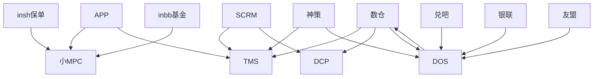

# 项目交接文档

## 1. TMS - 标签管理系统

### 基本信息
- **项目名称**: TMS (标签管理系统)
- **Git地址**: [待填写]
- **前端URL**: [待填写]
- **Jenkins部署地址**: [待填写]
- **后端URL**: [待填写]

### 功能描述
- 根据不同方式创建标签
- 标签数据来源于数仓和神策
- 定时任务每天把标签对应的SQL推送到数仓计算，然后结果下发到TMS
- 计算好的标签TMS对外提供用户的所有标签接口

### 用户系统
- **SCRM**: 客户关系管理系统
- **APP**: 移动应用
- **UDS**: 用户数据服务

### 数据流向
```
数仓 → 标签计算 → TMS → 对外提供标签接口
神策 → 标签数据 → TMS
```

---

## 2. DCP系统

### 基本信息
- **项目名称**: DCP (数据内容平台)
- **Git地址**: [待填写]
- **前端URL**: [待填写]
- **Jenkins部署地址**: [待填写]
- **后端URL**: [待填写]

### 功能描述
- 主要存储数仓下发的用户相关数据
- 对外提供查询接口供SCRM使用

### 用户系统
- **SCRM**: 主要使用者

### 数据流向
```
数仓 → DCP → 对外提供查询接口 → SCRM
```

---

## 3. DOS系统 - 数据管理系统

### 基本信息
- **项目名称**: DOS (数据管理系统)
- **Git地址**: [待填写]
- **前端URL**: [待填写]
- **Jenkins部署地址**: [待填写]
- **后端URL**: [待填写]

### 功能描述
- 神策数据同步到数仓
- 数仓数据同步到神策
- 其他各种数据同步：
  - 兑吧数据
  - 银联数据
  - 友盟数据
  - 等其他数据源

### 数据流向
```
神策 ↔ DOS ↔ 数仓
兑吧 → DOS → 数仓
银联 → DOS → 数仓
友盟 → DOS → 数仓
```

---

## 4. 小MPC系统

### 基本信息
- **项目名称**: 小MPC
- **Git地址**: [待填写]
- **前端URL**: [待填写]
- **Jenkins部署地址**: [待填写]
- **后端URL**: [待填写]

### 功能描述
- 接收APP传过来的银行用户信息
- 结合insh和inbb的保单、基金信息
- 判断是否属于银行用户

### 数据流向
```
APP → 小MPC ← insh保单信息
           ← inbb基金信息
           → 银行用户判断结果
```

---

## 系统关系图



## 注意事项
- 所有Git地址、URL地址需要根据实际情况填写
- 各系统间的数据同步频率和规则需要详细记录
- 定时任务的执行时间和监控方式需要明确
- 各系统的依赖关系和部署顺序需要确认
